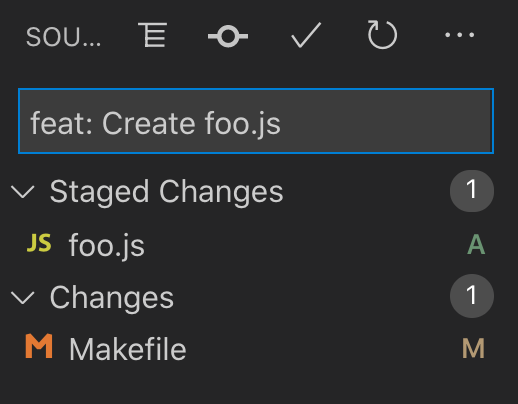
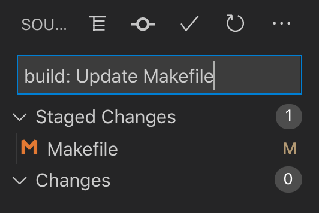
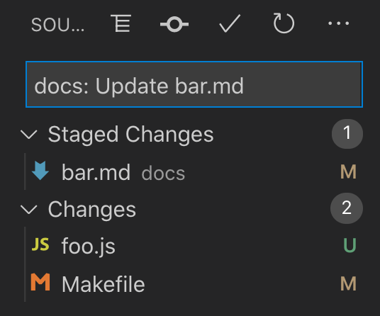
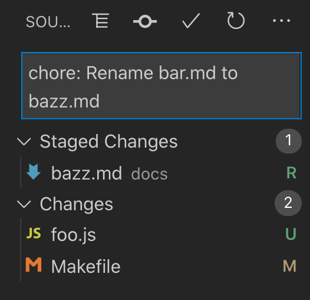

# Auto Commit Message ⚙️🧙‍♂️ ✉️
> A VS Code extension that writes commit messages for you

<!-- Badges generated with https://michaelcurrin.github.io/badge-generator/#/ -->

## Release disclaimer

- This application is still in **pre-release** stage.
- But... it is still functional and I use it daily, so please use it too if you want.
- There are just some finishing touches still, like making a new logo, releasing the package on the marketplace and cleaning up the docs. It can become version `1.0.0` around then.
- There are also a bunch of issues I want to work through to extend functionality to make the extension smarter.

## Overview

### Samples of generated commit messages

If you created a new file and staged it.

If you updated a build-related file.

If updated a file in `docs/` or a `README.md` anywhere.

If you renamed a file.

### Capabilities

This extension understands something about a single file and how it changed.

Here are supported action words which will be used.

- `Create`
- `Update`
- `Delete`
- `Move`
- `Rename`
- `Move and rename`

Based on the action and the file (directory, name and extension), a _semantic commit_ prefix will be derived from one of:

- `feat` - for new file
- `chore` - for config files and delete/rename the actions
- `build` - for package files and `Makefile` / `Rakefile`
- `ci` - GH Actions, CircleCI, BuildKite

You have to figure out when to use `fix`, `refactor` or `perf` yourself.

### How to use

Install the extension from a recent release on GitHub.

1. Open VS Code where you have a Git repo.
2. In the Git pane, click the extension's button.
3. Edit a single file. Or stage one file if you have many changes.
4. If possible, the extension will create a descriptive commit message for you in the commit message box.

<!-- TODO Add GIF here -->

## About

A VS Code extension which gives you smart commit message suggestions. For the times where all your need it a simple message.

It looks at the path of a file that changed and how it changed, then pushes the commit message to the Git pane in VS Code. You can edit or erase the message if you don't like.

It can make a message to **describe a change** for a single file to be committed. Including create, update, remove, rename and move - along with the filename. Or, the path, like for a move. See the [tests](https://github.com/MichaelCurrin/auto-commit-msg/blob/master/src/test/message.test.ts).

It many cases it can also provide an appropriate **semvar** label for you. It can't separate features and bug fixes but it can identify changes to docs, CI files and config files.

 Don't use this tool all the time - remember to write explantory messages when it matters.

## Purpose

This is a VS Code extension - when you run it, it will look at files changed and then generate a commit message for you and add it to the commit message box (using the Git Extension's UI).

It will look at files that are staged. If there are none, then it will look all changed unstaged files instead. The result will be a simple, descriptive message that fits on one line.

Note: At the moment a message can be generated based on one changed file.

The idea of this tool is to take the friction out of writing commit messages, so you that you commit more frequently (such as a with more one-line changes rather than mixing multiple unrelated changes together) and to save having to type out details that can be automatic or a tedious (mentioning long or difficult-to-type paths or filenames). This tool is not mean to be perfect - it gives a best guess for common cases.

It also not meant to replace writing messages by hand. It is a tool for myself mainly - 80% of my commit messages could have been written by an algorithm.

And for the other 20% when the change is important to describe in detail or hard to figure out programmatically (like class renames or bug fix descriptions), then I can still write my manual commit message.

This tool was inspired partly by GitHub's UI - it suggests a message in grey like "Update README.md" when I edit that file and if I enter nothing it uses that.

There are many tools out there that will _lint_ your commit message, or provide you a multi-line template, or will insert something in it like "feat:" or an emoji. But AutoCommitMsg writes you entire commit message for you in one line.

<!--
## Notes

This project is in development - it is very unstable and unpredictable but you can use the scripts or docs if they make sense to you. The focus has shifted away from making a terminal hook because VS Code handles is weirdly and on every UI commit, even if you only plan use it on the terminal.

I am please to announced that this now a lot more stable as of `v0.7.0`, but is not production ready (mainly cosmetic issues and a need to smooth the packaging flow). Next are items in GH issues, unchecked features list below, a local TODO file, some Semantic functions to use and some renaming tests to work on.

This is my first VS Code extension and first TypeScript project, so I am learning as a go and trying to follow best practices I find.
-->

## Features

What this VS Code extension can do:

- [x] Installable from archive file (see _assets_ list under latest [release](https://github.com/MichaelCurrin/auto-commit-msg/releases))
- [x] Handle staged files or working tree
- [x] Generate a single-line commit message for file to be committed, using action verbs (e.g. `Create`, `Update`, `Delete`)
- [x] Handle changes from a single changed file
- [ ] Handle changes from two or more files e.g. `Update 3 files in foo`, `Create foo.txt and fizz/bar.txt`, `Create foo.txt and delete bar.txt`
- [x] Keep user-entered value as a prefix e.g. Keep `docs:` (or ticket number) so message becomes `docs: Update README.md`
- [x] Use semantic prefix / conventional commits e.g. `chore: Update package.json`

### Topics areas

If recognizes files for a variety of languages and tooling, for providing an appropriate semantic commit message.

- [x] Python - package files and configs.
- [x] JavaScript, TypeScript  - package files and configs.
- [x] Ruby - package files and configs.
- [x] Go modules.
- [x] Circle CI, GitHub Actions - `ci`.
- [x] Makefile and package files for languages - `build`.
- [x] Config files like YAML, JSON and TOML - `chore` or `build`.

## Project plan

This project is a work in progress. It is starting out as a specification of the desired behavior on the [Wiki](https://github.com/MichaelCurrin/auto-commit-msg/wiki), then will tests added and then only the functionality last.

This will probably be in Python for easy scaling and tests. And it will probably use git commit hooks - whatever I find works well for command-line use and also VS Code messages if left blank but allowing manual overrides. And ideally showing the message just before its made so one can confirm. But this may be reaching too much especially for two entry methods. Maybe it can be generated when files are staged based on an event in VS Code.

### Tasks

Topics around structure and admin:

- [x] Works with `git` repos
- [x] Test coverage - Unit tests that are run with GitHub Actions CI
- [ ] Update logo
- [ ] Available in VS Code marketplace
- [ ] CI to build the package archive on tag
- [ ] Clean up docs and Wiki

## Documentation

## License

Released as [MIT](/LICENSE).

The core of this project's VS Code extension logic is creating a commit message and pushing to the Git Extension input box in the UI. That comes from the Git Prefix extension. Use of Git CLI in the extension comes from the Semantic Git Commit extension. Read about these in the [Credit](/docs/credit.md) section the docs.
